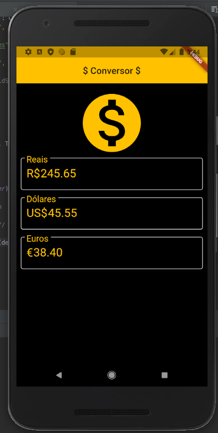

# conversor_moeda

Conversor de moeda - 3o Aplicativo do curso https://www.udemy.com/course/curso-completo-flutter-app-android-ios/

Para fazer com que a API funcione será necessário gerar uma chave no seu usuário no site responsável pela API que estamos utilizando: https://hgbrasil.com/,

Após isso substitua a palavra chave no arquivo `lib/main.dart` pela chave gerada após o cadastro
```
const request = "https://api.hgbrasil.com/finance?format=json&key=chave";
```




## Getting Started

This project is a starting point for a Flutter application.

A few resources to get you started if this is your first Flutter project:

- [Lab: Write your first Flutter app](https://flutter.dev/docs/get-started/codelab)
- [Cookbook: Useful Flutter samples](https://flutter.dev/docs/cookbook)

For help getting started with Flutter, view our
[online documentation](https://flutter.dev/docs), which offers tutorials,
samples, guidance on mobile development, and a full API reference.
